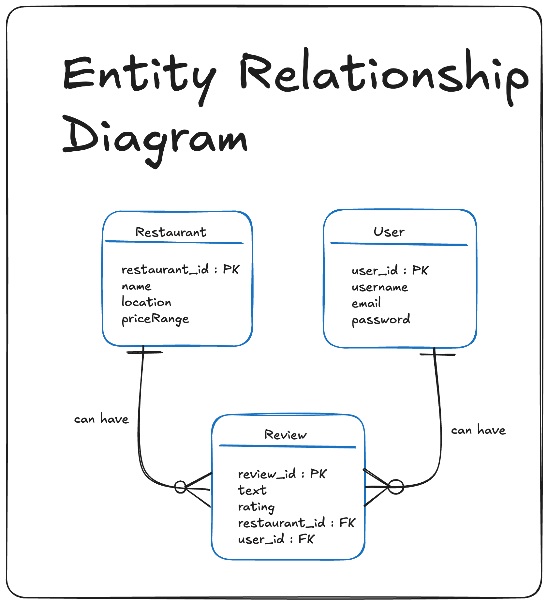
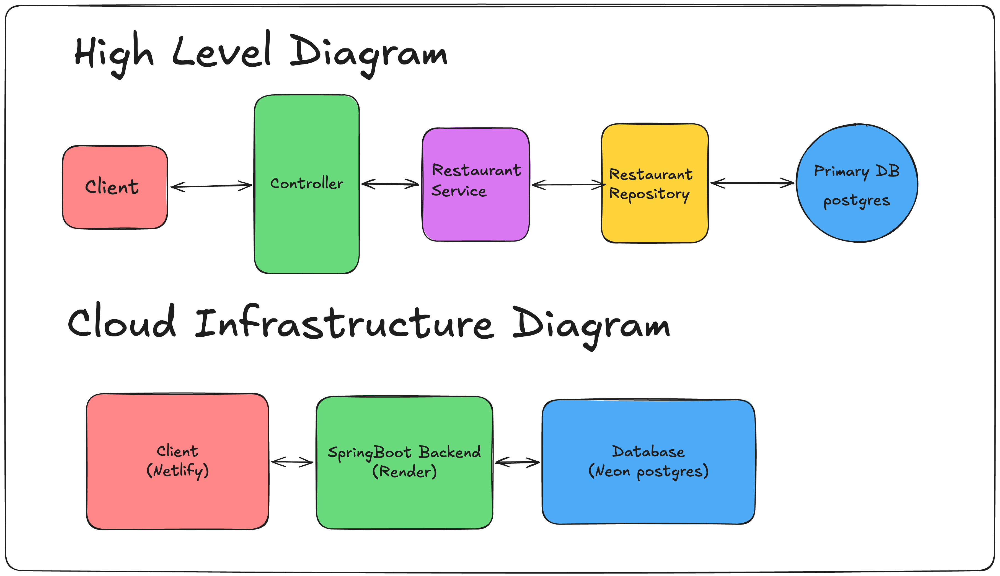

# Angular Material Yelp Clone - Backend (Spring Boot)
Cloud-deployed RESTful API built with Spring Boot and PostgreSQL, designed to serve the Yelp Clone frontend.

**Base API URL:** https://yelp-material-app-backend.onrender.com/api

## Architecture & Highlights
| ER Diagram | High Level and Cloud Infrastructure Diagram |
| :---: | :---: |
|  |  |
* **Concurrency Control:** Implemented **Pessimistic Locking** (`SELECT ... FOR UPDATE`) at the database level to prevent race conditions and lost updates when multiple admins edit the same restaurant simultaneously. Includes a 3-second timeout failsafe to prevent database deadlocks.
* **Containerization:** Fully containerized using Docker for consistent cross-environment execution.
* **Cloud Database:** Hosted on Neon (Serverless PostgreSQL).

## Tech Stack
* **Framework:** Java 17+, Spring Boot 3+
* **Database:** PostgreSQL (Neon)
* **ORM:** Spring Data JPA / Hibernate
* **Deployment:** Docker, Render Cloud

## API Endpoints
| Method | Endpoint | Description |
|---|---|---|
| `GET` | `/api/restaurants` | Fetch all restaurants |
| `GET` | `/api/restaurants/{id}` | Fetch a specific restaurant by ID |
| `POST` | `/api/restaurants/create` | Create a new restaurant |
| `PUT` | `/api/restaurants/{id}/update` | Update a restaurant (Protected by Pessimistic Lock) |
| `DELETE` | `/api/restaurants/{id}/delete` | Delete a restaurant |

## Local Development Setup
1. Clone repository: `git clone https://github.com/helloShreyasJ/yelp-material-app-backend.git`
2. Change directory: `cd yelp-material-app-backend`
3. Configure Local Environment:
    * Database Connection: Open src/main/resources/application.properties and replace the production Neon URL/credentials with your local PostgreSQL instance
        * `spring.datasource.url=jdbc:postgresql://localhost:5432/your_local_db_name`
        * `spring.datasource.username=your_local_username`
        * `spring.datasource.password=your_local_password`
    * CORS Policy: Open RestaurantController.java and change the @CrossOrigin annotation to allow requests from your local Angular development server:
        * `@CrossOrigin(origins = "http://localhost:4200")`
4. Run backend:
  * Maven: `./mvnw spring-boot:run`
  * Docker: `docker build -t yelp-backend .`
            `docker run -p 8080:8080 yelp-backend`
